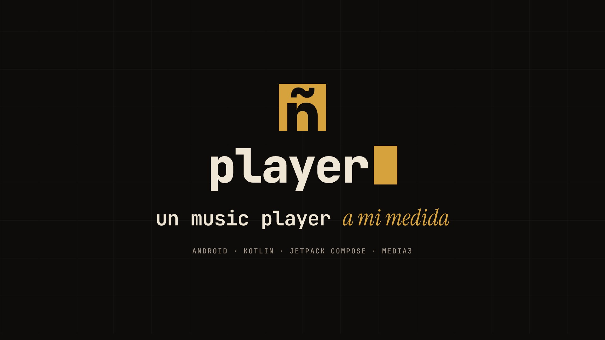

# Player

Reproductor de música personal, nativo para Android. El plan completo y su avance están en [ROADMAP.md](ROADMAP.md).

**Última versión estable: [v1.5.0](https://github.com/danielzunigazb/player/releases/latest)**. Descarga el APK desde [Releases](https://github.com/danielzunigazb/player/releases/latest) (Android 8.0 o superior). Web del proyecto: **[player.danzuniga.xyz](https://player.danzuniga.xyz)**.

[](https://github.com/danielzunigazb/player/releases/download/showcase-v1/PlayerShowcase.mp4)
<p><sub>▶ <a href="https://github.com/danielzunigazb/player/releases/download/showcase-v1/PlayerShowcase.mp4">Video de presentación</a>: se regenera solo con cada versión estable (Remotion en <code>player-showcase/</code>), con las novedades de sus notas y pantallas dibujadas desde la app. GitHub no reproduce en el README un mp4 de un release, así que el enlace abre o descarga el video.</sub></p>

## Funciones

**Biblioteca**
- Pestañas de Canciones, Álbumes, Artistas, Carpetas y Playlists, con detalle de cada uno
- Búsqueda en toda la biblioteca, sin distinguir mayúsculas ni acentos
- Ordenar por título, artista, álbum, añadidas recientemente o duración
- Se actualiza sola cuando agregas o borras música del teléfono

**Tus datos**
- Favoritas, playlists propias (crear, renombrar, borrar, reordenar arrastrando)
- Listas automáticas: Más escuchadas, Escuchadas recientemente, Añadidas recientemente

**Reproducción**
- Música en segundo plano con controles en la notificación, la pantalla de bloqueo y los auriculares/Bluetooth
- Al abrir la app retoma la última cola, canción y posición
- Cola editable: saltar, quitar y reordenar
- Reproducir a continuación / añadir a la cola desde cualquier canción
- Temporizador de apagado (por minutos o al terminar la canción), velocidad de reproducción
- Ecualizador con presets y refuerzo de graves
- Pantalla "Reproduciendo" con el color de la carátula; desliza la carátula o el mini reproductor para cambiar de canción
- Letras sincronizadas (resaltan la línea actual; toca una línea para saltar): desde un `.lrc` junto a la canción, incrustadas en MP3/FLAC o, si no trae, buscadas en [LRCLIB](https://lrclib.net) (gratis y sin cuenta). Solo se envían título, artista, álbum y duración; cada letra se guarda en el teléfono tras la primera descarga. Se desactiva en *Ajustes → Letras*.

**Compartir**
- Tarjetas 9:16 para historias (Instagram, Snapchat, WhatsApp…) con la carátula, o con hasta 4 líneas de la letra: mantén presionada una línea en la letra para elegirlas. En la terminal, `share` y `share lyric`
- Aviso de versión nueva: una vez al día consulta el último release en GitHub (se puede apagar); también en *Ajustes → Acerca de*

**Widget**
- Widget de pantalla de inicio con carátula y controles; reproducir retoma la última cola aunque la app esté cerrada

**Android Auto y voz**
- Explora tu biblioteca desde el coche; elegir una canción encola su álbum o playlist
- "Pon X en Player" por voz reproduce lo que coincida

**Ajustes**
- Tema del sistema, claro, oscuro o negro puro (AMOLED), colores Material You
- Idioma: español o inglés, según el teléfono o elegido en *Ajustes → Idioma* (en Android 13+ también en los ajustes del sistema para la app)
- Ignorar audios cortos (notas de voz, tonos)
- Completar etiquetas en internet: las canciones sin artista ("24K - T3R Elemento") se comprueban en LRCLIB y se corrigen solo si coincide la duración. No modifica los archivos y cada una se puede restaurar desde su menú

## Terminal

El botón `>_` del inicio abre una consola para manejar la música escribiendo, con autocompletado sobre tu biblioteca:

```
$ play soda stereo        # artista, álbum o canción, sin importar acentos
$ play album signos       # artist / album / song para ser específico
$ queue eres              # al final de la cola · next <algo> la pone a continuación
$ shuffle                 # toda la biblioteca
$ now                     # progreso [████░░░░] y la línea de la letra que suena
$ sleep 30m · speed 1.25 · seek 1:30 · repeat · fav · top · ls · help
```

## Idiomas

Inglés es el idioma base (`res/values/strings.xml`) y el español está completo en `res/values-es/`. Cualquier otro idioma del teléfono cae al inglés. La terminal traduce sus respuestas en `ui/terminal/ShellText.kt`, pero los comandos (`play`, `queue`…) son iguales en todos los idiomas. Para agregar un idioma:

1. Crea `res/values-xx/strings.xml` con todas las cadenas. Lint falla si falta alguna.
2. Agrega una implementación de `ShellText`. El compilador exige todas las respuestas y `ShellTest` revisa las descripciones.
3. Súmalo a `AppLanguage` para que aparezca en Ajustes.

## Diseño

La interfaz usa el sistema de diseño **Daniel Zúñiga** (claude.ai/design) portado a Compose:

- **Tokens** en `ui/theme/Theme.kt` (`DzColors`): temas Obsidiana (oscuro) y Pergamino (claro), `gold` como único acento, `verdigris` y `ember` para estados. La jerarquía se construye con `bg` → `surface` → `line`, sin sombras.
- **Tipografía** en `ui/theme/Type.kt`: JetBrains Mono como voz e Instrument Serif itálica como susurro (el artista en el reproductor, "música" en el inicio). Ambas tienen licencia SIL OFL y están en `res/font`.
- **Íconos** en `ui/theme/DzIcons.kt`: los 17 trazos del sistema más los del reproductor, dibujados con las mismas reglas (grilla de 24, trazo de 1.5, puntas cuadradas, sin relleno).
- **Componentes** en `ui/components/Dz.kt`: `DzButton`, `DzIconButton`, `DzTag`, `DzTitle` (con susurro y cursor), `DzMark`, `Eyebrow` y `Hairline`.
- El **ícono de la app** es el monograma: la ñ recortada de un bloque dorado.

## Firma

Los APK de release se firman con la llave de release de Player (certificado SHA-256 `8d7449ce…4f23cf36c`). Es la misma que firmó todas las versiones desde la 1.0.0, así que cada actualización se instala encima sin perder datos. **Si se pierde esa llave, ninguna versión futura podrá actualizar la app instalada**: guárdala en un lugar seguro.

- **CI:** toma la llave de tres secrets del repo: `PLAYER_KEYSTORE_BASE64` (el `.jks` en base64), `PLAYER_KEYSTORE_PASSWORD` y `PLAYER_KEY_PASSWORD`. El alias (`player`) va como valor fijo en los workflows. El paso "Show signing certificate" imprime la huella del APK para comprobarla.
- **Local:** copia `keystore.properties.example` a `keystore.properties` (ignorado por git) y completa la ruta y las contraseñas. También sirven las variables de entorno `PLAYER_KEYSTORE_FILE`, `PLAYER_KEYSTORE_PASSWORD`, `PLAYER_KEY_ALIAS` y `PLAYER_KEY_PASSWORD`.
- **Sin llave:** el build de release se firma con la llave de debug de esa máquina y avisa. Con `PLAYER_REQUIRE_RELEASE_KEY=true` (builds de versiones estables) falla en vez de hacerlo.

## Arquitectura

Kotlin, Jetpack Compose (Material 3), MVVM, Media3/ExoPlayer, Room, Navigation Compose.

```
app/src/main/java/com/danielzuniga/player/
├── PlayerApplication.kt   AppContainer: repositorios compartidos por la UI y el servicio
├── data/                  MediaStore (MusicRepository), Room (db/, UserDataRepository), ajustes,
│                          letras (lyrics/: LRC, ID3 USLT, FLAC Vorbis, cliente LRCLIB)
├── playback/              PlaybackService (ExoPlayer + MediaSession), PlayerConnection,
│                          ecualizador, guardado de la cola
├── widget/                Widget de pantalla de inicio
└── ui/                    ViewModels, navegación, pantallas (library, detail, playlists,
                           player, equalizer, settings)
```

## Compilar e instalar

Requisitos: JDK 17+ y el Android SDK (API 35). Lo más fácil es abrir el proyecto en Android Studio y pulsar Run.

Desde la terminal, con el móvil conectado por USB (depuración USB activada):

```bash
./gradlew installDebug          # instala la versión debug
./gradlew assembleRelease       # APK optimizado en app/build/outputs/apk/release/
./gradlew testDebugUnitTest     # pruebas (JVM + Robolectric: UI, servicio y base de datos)
./gradlew lintDebug             # análisis estático
```

Cada push a GitHub compila, prueba y publica el APK como artefacto en la pestaña **Actions** (`player-apk`).

## Versiones

Los releases salen solos, desde el workflow **Release** en cada push a `main`:

- **Estable:** cuando `main` trae un `versionName` sin release todavía. Sube `versionName` y `versionCode` en `app/build.gradle.kts`, escribe las notas en `docs/releases/vX.Y.Z.md`, mergea, y se publica `vX.Y.Z` como *latest*, con el APK y su `.sha256`. También sale al subir un tag `vX.Y.Z`.
- **Dev:** cualquier otro push a `main` reemplaza el prerelease `dev` con `Player-dev.apk` (versión `X.Y.Z-dev.N`). Sirve para probar lo último antes de que sea versión. La app solo avisa de versiones estables.

Los dos pasan tests y lint, exigen la llave de release y comprueban el certificado antes de publicar. Cada estable adjunta además `CHANGELOG.md`, generado por `scripts/changelog.py`. En los PR, el CI rechaza un cambio de `versionName` si no sube `versionCode` o si faltan sus notas. Dependabot propone cada lunes las actualizaciones de Gradle, npm y Actions, agrupadas. La web lee las dos versiones de GitHub al abrirse, así que muestra un release nuevo al instante.

Después de cada estable, el workflow **Showcase video** hace tres cosas: dibuja las pantallas desde la app (`ShowcaseShotsTest`), arma la escena "Novedades" con cada `###` de las notas de la versión (su título y la primera oración, o las etiquetas en negrita si las hay) y renderiza el video. Luego lo adjunta al release y a `showcase-v1`, y la web se vuelve a publicar con él. En la práctica: **escribe código, sube `versionName`, escribe las notas y mergea**; lo demás sale solo.

Para ver las pantallas o el video en local:

```sh
./gradlew testDebugUnitTest --tests '*ShowcaseShotsTest*' -PshowcaseShots="$PWD/player-showcase/public/img"
cd player-showcase && npm ci && npm run render   # o npm run dev para Remotion Studio
```

## Web

[player.danzuniga.xyz](https://player.danzuniga.xyz) sale de `site/` y la publica el workflow **Site** en GitHub Pages. Se vuelve a publicar cuando cambian el sitio, las capturas o `versionName`, y después de cada release o video nuevo, así que el enlace de descarga y el video no se quedan viejos. `site/build.sh` arma la página en `_site/` para verla en local (`python3 -m http.server -d _site`); el video solo lo agrega CI.
